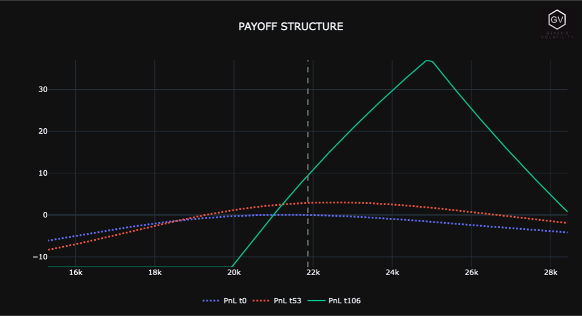
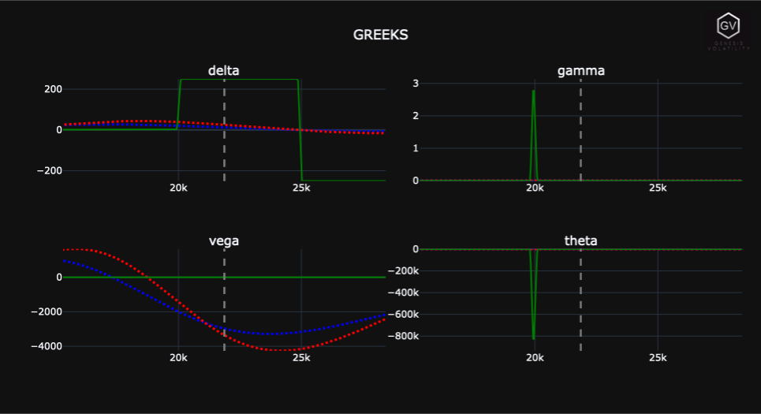
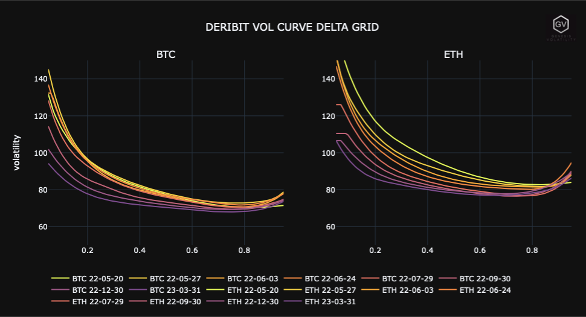
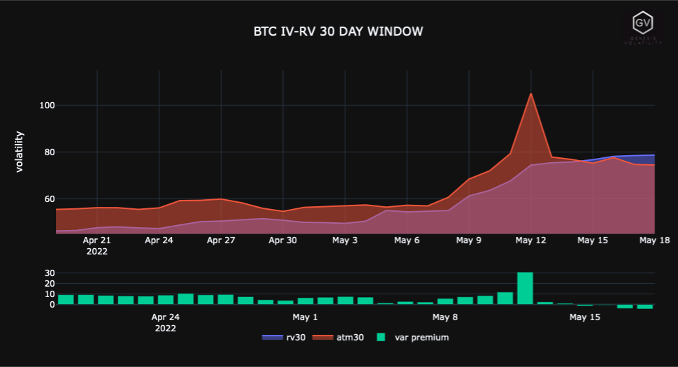
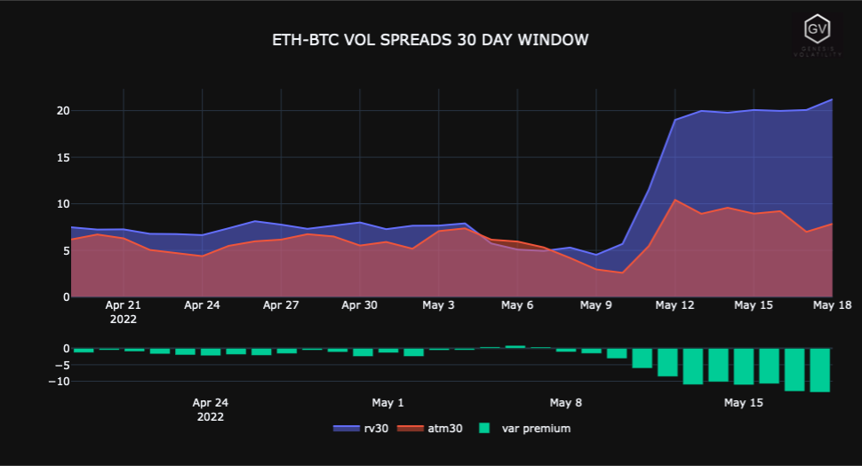
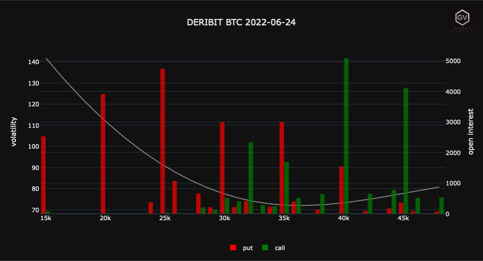

# GVol API - Lite Jupyter Notebook

These notebooks are intended to get you up to speed FAST. Drop in your GVol API key in the notebook and start your analysis.
Remember to `pip install` dependencies.

## Installation

Use the package manager [pip](https://pip.pypa.io/en/stable/) to install [gvol](https://pypi.org/project/gvol/).

```bash
pip install gvol
```

## Usage

Basic GVol usage.

```python
from gvol import GVol

#create GVol Client
gvol_client = GVol(header='x-oracle',gvol_api_key=GVOL_API_KEY)
gvol_client = GVol(header='gvol-lite-plus',gvol_api_key=GVOL_API_KEY_LITE_PLUS)
gvol_client = GVol(header='gvol-lite',gvol_api_key=GVOL_API_KEY_LITE)

##SELECT EXCHANGE: (Supported exchanges are |deribit|bitcom|okex|delta|)
exchange = 'deribit'

data = gvol_client.UtilityRealtimeOptionbook(exchange=exchange)

```

## Contributing

Pull requests are welcome. For major changes, please open an issue first to discuss what you would like to change.

Find Edge, Capture Alpha, Slang Size.
:heart: [gvol.io](www.gvol.io) :heart:

## Example Charts






